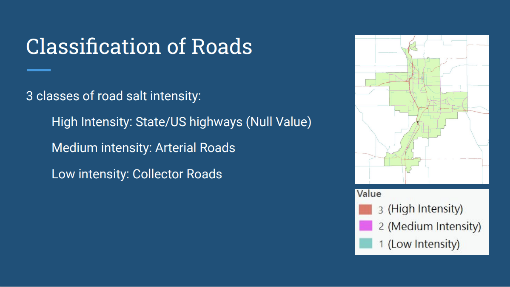
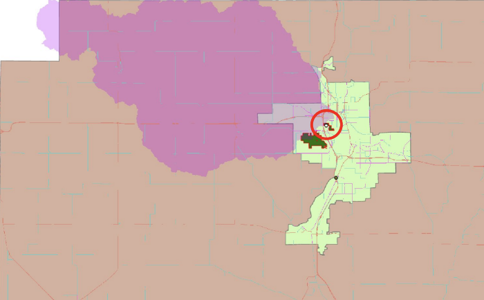
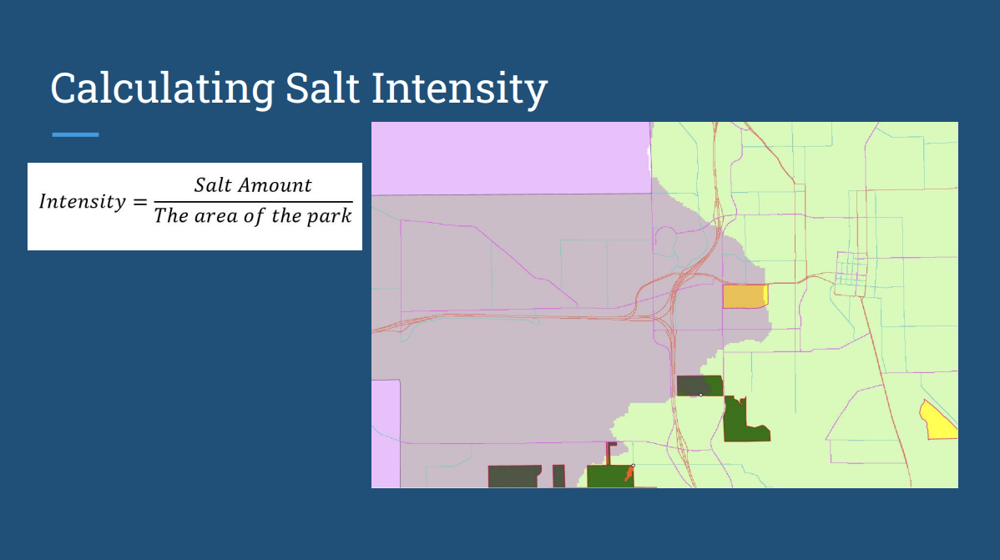
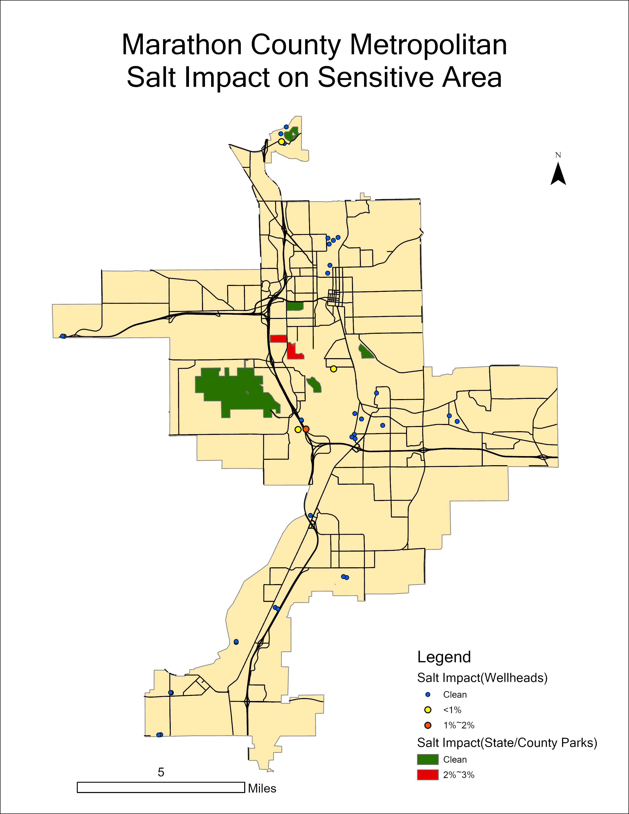

# Environment Impact by Road Salt Use in Marathon County Metropolitan Area
Course: GIS Application | UW-Madison 
Instructor: A-Xing Zhu 
Teaching Assistant: Yuying Chen
Group Members: Grace Harvey, Laura Flucke, Kuang-Cheng Cheng, Noah Sticha
## Methods/Steps
Classified by Attribute: Classified Road based on road type, which is directly related to the salt use intensity

D8 flow method: Create Drainage Basin to understand the underground water behavior

Zonal statistics: Overlay two layers to calculate the Salt Intensity

## Result

## My contribution to this project
I was responsible for using GIS functions to create the drainage basin for Marathon County as part of this project. I worked alongside our professor and TA, conducting research on the documentation of ArcGIS Pro to complete the task.

## Project Background Information
This project is a real-world project referred by the course instructor through contact with staff at <a href='https://univercity.wisc.edu/'>UniverCity Alliance</a>. 
This repository documents the evaluations that several classmates and I did for a transportation planner working at the Wausau Metropolitan Planning Organization According to information from the planner, this project failed many times to get a usable result. He thinks that the heavy road salt used on the roads in winter may potentially bring environmental contamination when the salts are melted and go into the underground water. Thus, he wants to entrust us to use GIS technology to analyze whether there will actually be environmental impacts as he is concerned, and at the same time, he hopes we can show the degree and location of the impact with a map at the end
## More Information
For acquiring more details and information, check out [our report](GEOG 578 Salt Use Final Report.pdf) in the repository.
